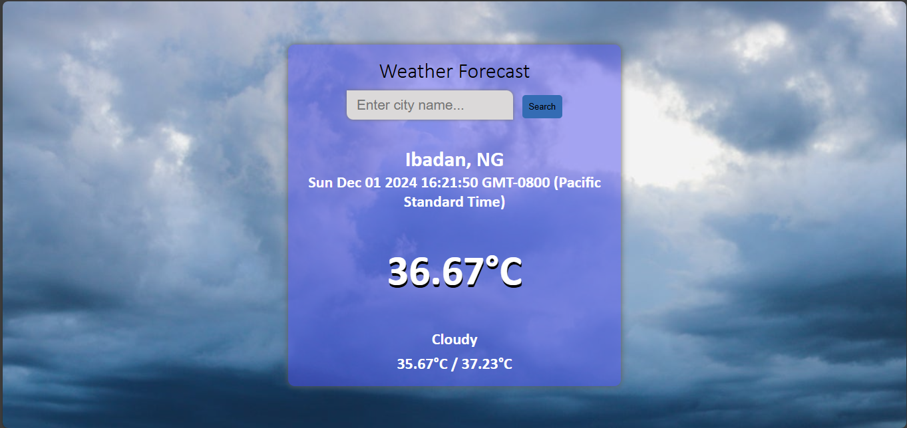

# Simple Weather Application using HTML, CSS & JavaScript

This web application allows one to check the weather condition of a particular location just by entering the city name.

# Technologies Used

1. **HTML5** for structure
2. **CSS3** for styling
3. **JavaScript** for front-end functionality
4. **OpenWeather API** for fetching the weather data.

# Screenshot

HomePage
- 

